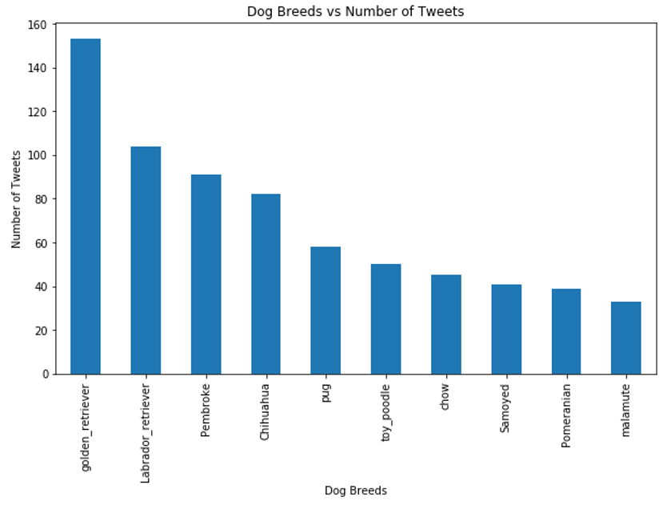
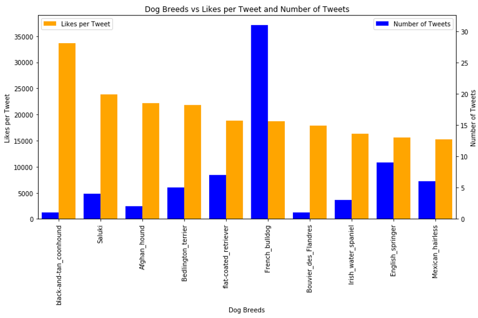
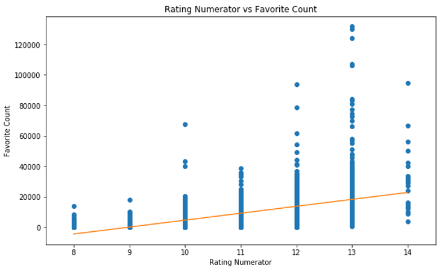

# Twitter-WeRateDogs Data Analysis
In this analysis, we analyzed WeRateDogs tweets over the time period 11/15/2015 and 8/1/2017. The motivation for this analysis was to answer the following three questions.  
1. What breed of dogs most frequently appear on WeRateDogs Twitter?  
2. What breed of dogs get the most likes per tweet?  
3. Does high rating correlate to high likes? 

## Datasets
This analysis uses three datasets.   
1. Twitter-archive-enhanced.csv: a list of tweets of interest provided by Udacity.  
2. Image-predictions.tsv: a neural network output predicting dog breeds from the image provided in the tweet.  
3. Tweet_json.txt: a JSON text file that was generated using Twitter API (tweepy) querying the list of tweets from twitter-archive-enhanced.csv

## What species of dogs most frequently appear on WeRateDogs Twitter?

Golden retriever and Labrador retriever have the most WeRateDogs tweets with about 150 and 100 tweets, respectively. Of the top ten most tweeted dog breeds, only three (golden retriever, Labrador retriever, poodle) were in the Most Popular Dog Breeds ranking list. This suggests that owners of certain dog breeds may use twitter and send dog pictures to WeRateDogs more often than owners of other dog breeds.

## What breed of dogs get the most likes per tweet?

The figure above examines the relationship between dog breeds and likes per tweet. The dog breed that received the most likes per tweet was “black and tan coonhound,” as labeled by neural network image predictions. There was only one tweet for this breed of dog.  

## Does high rating correlate to high likes? 

There is moderate correlation between rating numerator and favorite count with a RSquared value of 0.48 and Standard Error of 208. There is a trend that higher rating correlates with more favorite counts. However, this model breaks down at lower ratings. The model suggest that a rating of 8 will have a negative favorite count, which is not possible.

## Files
act_report.pdf: report of findings 
image-predictions.tsv: image prediction output from machine learning course 
tweet_json.txt: tweets retrieved using Twitter API (tweepy) 
twitter_archive_master.csv: output from wrangle_act.ipynb; this is a comprehensive dataset combining data from image-predictions.tsv, tweet_json.txt, and twitter-archive-enahcned.csv 
twitter-archive-enhanced.csv: initial analysis of WeRateDogs tweet by Udacity 
wrange_report.pdf: report of wrangle process of wrangle_act.ipynb 
wrangle_act.ipynb: Jupyter notebook of data analysis
